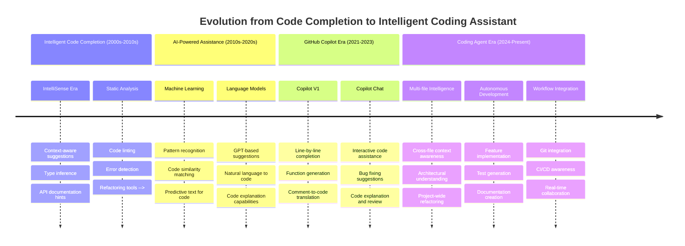

# GitHub Copilot Coding Agent - Experiment

## Session Information
**Title:** GitHub Copilot Coding Agent - Experiment  
**Description/Overview:** Explore GitHub Copilot Coding Agent - the new AI coding assistant  
**Duration:** 90 minutes  
**Date:** TBD  
**Presenter:** [Your Name]  

---

## Expected Outcomes

### For Participants
- Understanding of GitHub Copilot Coding Agent capabilities
- Practical knowledge of AI-assisted development workflows
- Awareness of best practices and potential pitfalls

### For Organization
- Assessment of AI coding tool adoption potential
- Identification of workflow optimization opportunities
- Evaluation of productivity and quality impact

---

## Agenda

1. **Overview** of GitHub Copilot and the Latest Coding Agent Feature
2. **Live Demo**: How Coding Agent Works in Real-World Scenarios
3. **Discussion**: Pros, Cons, and Workflow Optimization

---

## 1. Overview of GitHub Copilot and the Latest Coding Agent Feature
### Introduction to GitHub Copilot

#### **What What is GitHub Copilot?**

> - https://docs.github.com/en/copilot/about-github-copilot/what-is-github-copilot

#### **What's New: Coding Agent Feature**
An autonomous AI agent that can make code changes for you.

  

> - https://docs.github.com/en/copilot/using-github-copilot/coding-agent

### 2. Live Demo: How Coding Agent Works in Real-World Scenarios (25 minutes)

#### Demo Environment Setup
- **Project Context:** Spring Boot Task Management System
- **Architectural Patterns:** Clean Architecture with intentional violations for demo
- **Technologies:** Spring Boot 3.x, Spring Security 6.x, PostgreSQL

#### Demo Scenarios

**Scenario A: Feature Implementation (10 minutes)**
- Implementing a new task analytics feature
- Showcasing multi-file coordination
- Demonstrating architectural decision-making

**Scenario B: Architectural Refactoring (8 minutes)**
- Fixing Clean Architecture violations
- Moving from infrastructure-contaminated domain to pure domain model
- Repository pattern implementation

**Scenario C: Bug Fixing and Testing (7 minutes)**
- Identifying and fixing security vulnerabilities
- Generating comprehensive test suites
- Integration test implementation with TestContainers

### 3. Discussion: Benefits, Limitations, and Workflow Optimization (15 minutes)

#### Benefits

- Frees up time for more complex work
- Handles "nice to have" backlog items
- Starts project scaffolding
- Performs code refactoring and adds logging
- Allows you to tackle tasks you might not have resources for otherwise

#### Limitations

- Works within single repository only
- Opens exactly one pull request per task
- Always starts from default branch
- Cannot work on existing pull requests it didn't create
- Doesn't sign commits
- Doesn't work with self-hosted GitHub Actions runners
- Doesn't account for content exclusions

#### Workflow Optimization Strategies

1. **Create clear issues** - Write like AI prompts with specific descriptions, acceptance criteria, and guidance on files that need changes
2. **Choose the right type of tasks**

    - Assign to Copilot: bugs, UI changes, tests, docs.
    - Do yourself: complex, sensitive, ambiguous tasks or for learning purposes

3. **Use PR comments effectively** - Batch comments using "Start a review" instead of individual comments
4. **Add custom instructions** - Create .github/copilot-instructions.md file to guide Copilot on code standards, structure, and guidelines
5. **Optimize environment** - Configure copilot-setup-steps.yml to pre-install dependencies, use MCP to extend capabilities
